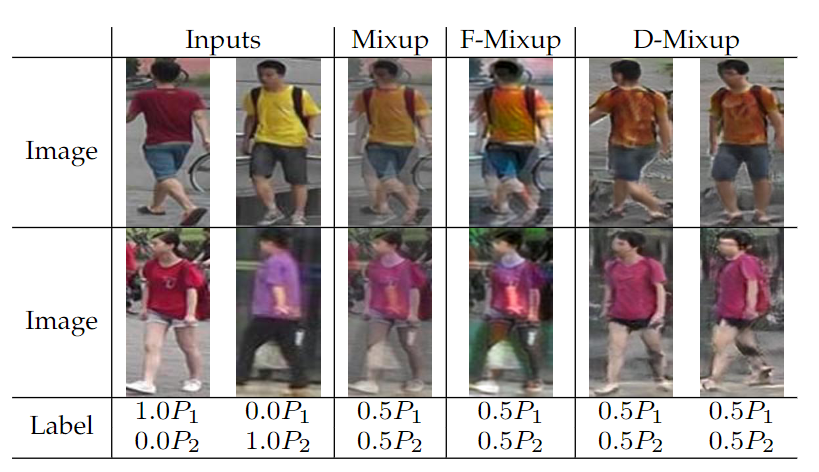
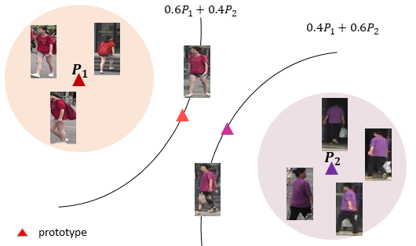

# Learning Invariance from Generated Variance for Unsupervised Person Re-identification

This is the official PyTorch implementation of the TPAMI paper [Learning Invariance from Generated Variance for Unsupervised Person Re-identification](https://ieeexplore.ieee.org/document/9970293).

The paper is an extened version of [Joint Generative and Contrastive Learning for Unsupervised Person Re-identification](https://arxiv.org/pdf/2012.09071.pdf).

<p float="left">
    
    
</p>

## Installation

### Install GCL
Requirements
* Python 3.6
* Pytorch 1.2.0
```shell
git clone https://github.com/chenhao2345/GCL-extended
cd GCL-extended
python setup.py develop
```

## Prepare Datasets

```shell
cd examples && mkdir data
```
Download the raw datasets [DukeMTMC-reID](https://arxiv.org/abs/1609.01775), [Market-1501](https://www.cv-foundation.org/openaccess/content_iccv_2015/papers/Zheng_Scalable_Person_Re-Identification_ICCV_2015_paper.pdf), [MSMT17](https://arxiv.org/abs/1711.08565),
and then unzip them under the directory like
```
GCL/examples/data
├── dukemtmc-reid
│   └── DukeMTMC-reID
├── market1501
└── msmt17
    └── MSMT17_V1(or MSMT17_V2)
```

### Install HMR for Mesh Estimation
Download our extracted meshes from [Google Drive](https://drive.google.com/drive/folders/1N6c8G5m_RCY2TbwHd9C954qjW6wA8to2?usp=sharing). Unzip them under the directory like
```
GCL/examples/mesh
├── dukeMTMC
├── market
└── msmt17
```

Or refer to [HMR](https://github.com/akanazawa/hmr) ro get meshes for ReID datasets.

## Train GCL
Only support 1 GPU (GPU memory > 20GB) training for the moment.
### Stage 1: Warm up identity encoder
Train a ResNet50 with an unsupervised method, for example, [JVTC](https://github.com/ljn114514/JVTC)(or download our trained models from [Google Drive](https://drive.google.com/drive/folders/1aOSPhVc0MlwSTBVMbY9V46dBS84WpXGq?usp=sharing)) and [MLC](https://github.com/kennethwdk/MLCReID).
```
GCL/examples/logs
└── JVTC
    └── market
        └── resnet50_market075_epoch00045.pth
    └── duke
        └── resnet50_duke075_epoch00040.pth
```
### Stage 2: Warm up structure encoder and discriminator
Adjust path for dataset, mesh, pre-trained identity encoder. 
```shell
sh train_stage2_market.sh
```

### Stage 3: Joint training
```shell
sh train_stage3_market.sh
```
## TensorBoard Visualization
### Stage 2: 
For example,
```shell
tensorboard --logdir logs/market_init_JVTC_unsupervised/
```
### Stage 3: 
For example,
```shell
tensorboard --logdir logs/market_init_JVTC_unsupervised/stage3/
```

## Citation
```bibtex
@ARTICLE{9970293,
  author={Chen, Hao and Wang, Yaohui and Lagadec, Benoit and Dantcheva, Antitza and Bremond, Francois},
  journal={IEEE Transactions on Pattern Analysis and Machine Intelligence}, 
  title={Learning Invariance from Generated Variance for Unsupervised Person Re-identification}, 
  year={2022},
  volume={},
  number={},
  pages={1-15},
  doi={10.1109/TPAMI.2022.3226866}}
```